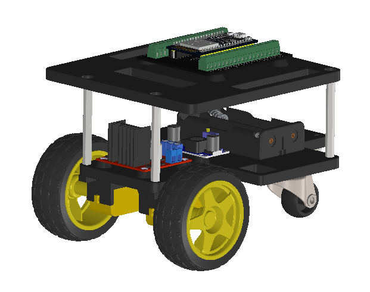
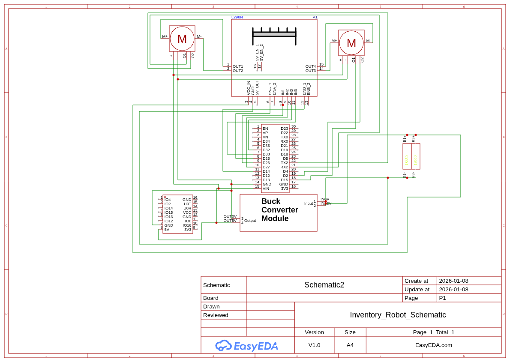

Autonomous IoT Inventory Robot
==============================

  

### **The Vision**

This project bridges the gap between physical robotics and cloud intelligence. It is not just a robot; it is a fully autonomous agent capable of navigating dynamic environments, digitizing physical inventory, and syncing with the cloud in real-time. Designed as a Computer Engineering Final Project, it simulates a real-world logistics solution using cutting-edge technologies.

### **Core Technologies**

*   **Embedded Control:** ESP32, ESP32-CAM & FreeRTOS
    
*   **Robotics Middleware:** MQTT , Micro-ROS & ROS 2
    
*   **Cloud Backend:** AWS IoT Core, Lambda, DynamoDB
    
*   **Visualization:** Amazon Grafana
    

### System Architecture: How It Works

The system is designed with a **hybrid communication architecture** to ensure low-latency control and secure data transmission:

**1. The Edge (The Hybrid Robot)** The robot, powered by the **ESP32-CAM**, runs two parallel network stacks to handle distinct tasks:
* **Navigation (Micro-ROS):** The robot functions as a native ROS 2 node over UDP, listening for velocity commands (`/cmd_vel`) to execute precise motor control.
* **Data Transmission (Local MQTT):** Independently, when a QR code is detected, the ESP32 publishes the decoded data via a lightweight MQTT client to the local network. This separation ensures that heavy video/data processing does not interfere with the real-time navigation loop.

**2. The Bridge (Local Gateway)** The local computer serves as the central traffic controller, running two distinct services to handle the split traffic:
* **Micro-ROS Agent:** A Docker container that bridges the robot's UDP control signals to the global ROS 2 network.
* **Secure IoT Gateway:** A custom Python script that listens to the local MQTT data stream, encrypts the payloads using **X.509 certificates**, and securely forwards the inventory records to the AWS Cloud.

**3. The Cloud (AWS Backend)** The data lands in **AWS IoT Core**, triggering a Serverless Lambda function. This function enriches the data with precise server-side timestamps and stores the inventory state in a NoSQL **DynamoDB** table.

**4. The Insight (Dashboard)** **Grafana** visualizes the data instantly, showing live stock levels (e.g., "Apples: 50") and historical trends, enabling data-driven decision-making.

  

### **Hardware Components**

*   **Controller:** ESP32-CAM (AI-Thinker), ESP32
    
*   **Drive System:** L298N H-Bridge with DC Gear Motors
    
*   **Power:** High-discharge 18650 Li-Ion Battery Pack (7.4V), Buck convertor
    
*   **Chassis:** Custom Acrylic Platform
    

  

### **See It In Action**

**Author:** Shahar Halevi_Computer Engineering Student_
